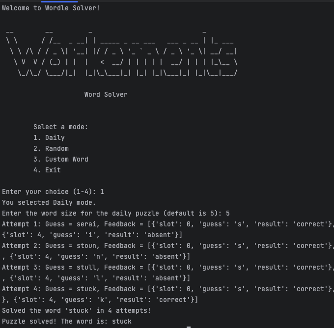
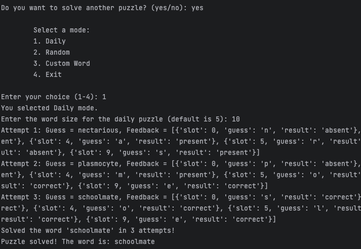
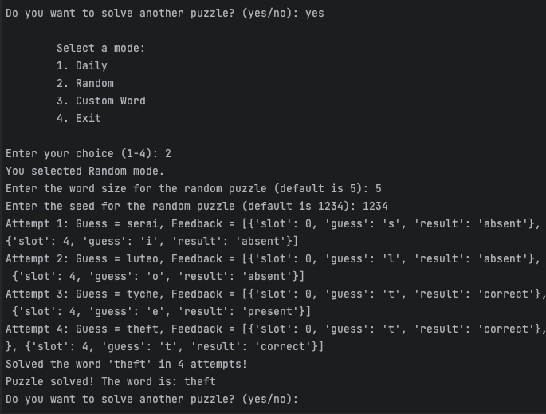
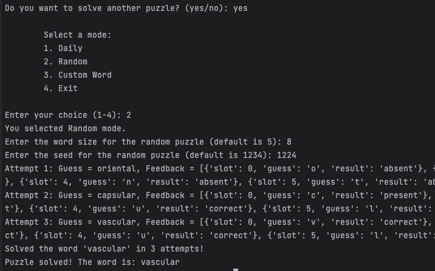
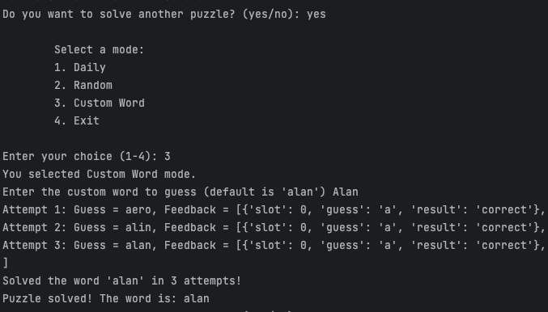
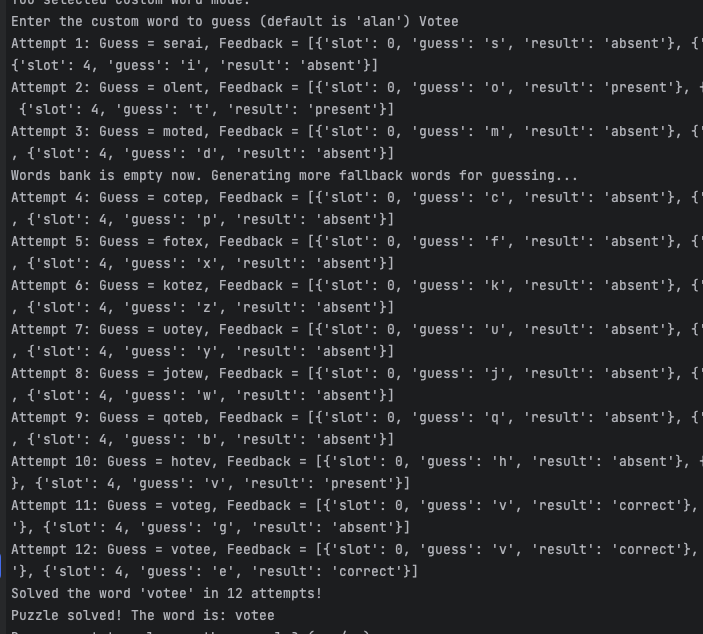

# Word Solver

Word Solver is a tool that helps users guess words efficiently by utilizing a word bank and entropy-based filtering. The solver is designed to guess daily words, random words, or custom words, with feedback categories including **Correct**, **Present**, and **Absent**.

## Main Features

1. **Daily Word Guess**  
   Guess the daily word with a specific size.  
   [Try it here](https://wordle.votee.dev:8000/daily)

2. **Random Word Guess**  
   Guess a random word using word size and seed.  
   [Try it here](https://wordle.votee.dev:8000/random)

3. **Guess the Custom Word**  
   Enter a custom word to solve.  
   [Try it here](https://wordle.votee.dev:8000/word/{word})


## Feedback Categories

- **Correct**: The guessed letter is in the correct position.
- **Present**: The guessed letter exists in the word but is in the wrong position.
- **Absent**: The guessed letter is not in the word.

---


## Approach

1. **Create a Word Bank**  
   A large word corpus is built using **NLTK**.

2. **Filter by Word Length**  
   Filter the word bank according to the length of the target word.

3. **Select High-Entropy Words**  
   The word with the highest entropy (providing the most valuable information) is selected as the guess.

4. **Process Feedback**  
   After receiving the API feedback (Correct, Present, Absent), signals are collected.

5. **Filter by Signal**  
   Based on the feedback signals, the word bank is filtered, progressively narrowing down the choices until the correct word is identified.

### Potential Problem

If the secret word is not found in the original word bank, we extend the word bank to a larger size.

### Fallback Approach

If necessary, we extend the word bank by generating randomized characters combined with the signals (Correct, Present, and Absent) collected from previous guesses.

---

## How to Run the App

Follow these steps to install the necessary packages and run the Word Solver app:

### 1. Clone the Repository
First, clone the repository to your local machine:
```bash
git clone https://github.com/alan5543/word-solver.git
cd word-solver
```

### 2. Install the Python packages
```bash
pip install -r requirements.txt
```


### 3. Run the Python Command App Program
```bash
python word_solver.py
```

---

## Demonstration: How to Play the Command Line App

The following section demonstrates how to play Word Solver using different modes in the command line.

### 1. Select Daily Mode

#### Example 1: Word Size = 5
- The user selects the **Daily Mode** with a word size of 5. The solver will attempt to guess the daily word by filtering the word bank to words of this length.
  


#### Example 2: Word Size = 10
- The user selects the **Daily Mode** with a word size of 10. The solver will narrow down the word bank to 10-letter words and proceed to guess the daily word.
  


### 2. Select Random Mode

#### Example 1: Word Size = 5, Seed = 1024
- The user selects **Random Mode** with a word size of 5 and a seed of 1024. The solver will choose a random word of the specified size based on the seed and begin guessing.



#### Example 2: Word Size = 8, Seed = 1224
- The user selects **Random Mode** with a word size of 8 and a seed of 1224. The solver will pick an 8-letter word and use the seed to randomize the selection process.



### 3. Select Custom Word Mode

#### Example 1: Custom Word = Alan
- The user selects **Custom Word Mode** and enters the word "Alan". Since the word exists in the original corpus, the solver will narrow down the search accordingly and guess the word efficiently.



#### Example 2: Custom Word = Votee
- The user selects **Custom Word Mode** and enters the word "Votee". Since "Votee" is not in the original corpus, the solver will extend the word bank to a larger size and attempt to guess the word using the fallback approach.



Each of these steps highlights how the Word Solver approaches solving different types of word guesses in the command line. Screenshots demonstrate the actual execution of each mode.


---

**Contributors:**  
- Alan Yang
